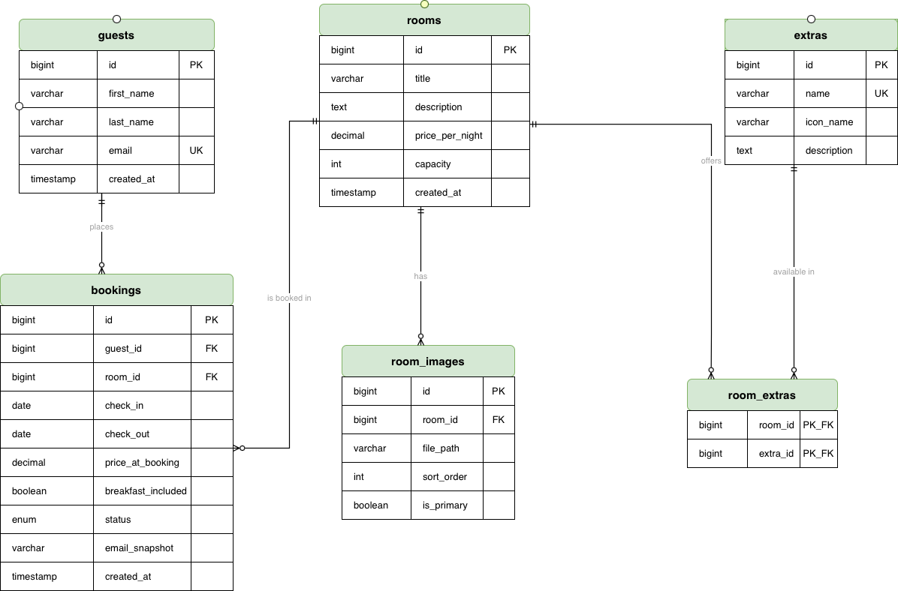

# ACE Escapes

A hotel booking web app for the Boutique Hotel Technikum. Backend with Spring Boot, frontend with Ionic + Vue 3.

## Team

See [team.md](team.md).

## Docs

- [API Specification](Docs/ACE_Escapes_Hotel_Booking_API.pdf) – OpenAPI 3.0, built with Swagger
- [ER Diagram](Docs/ACEEscapes_diagram.png) – database model (Draw.io)
- [Web Prototype](Docs/ACE_Webprototype.pdf)
- [Mobile Prototype](Docs/ACEEscapes_MobileProtoype_v2.0.png)



Quick note on the data model: the main tables are `rooms`, `bookings`, `extras` and `room_images`.
After the feedback we moved the `extras` (e.g. Wi-Fi, breakfast) out of the old comma-separated field
into their own table and linked them to the rooms through the `room_extras` junction table. That way
we avoid the error-prone text search and can keep the features clean. Prices (`price_per_night`) are
stored as `DECIMAL` instead of `FLOAT` so there are no rounding issues with the amounts.

## Tech Stack

**Backend**
- Java 17 with Spring Boot 3
- MariaDB as the database
- Clean Architecture (Robert C. Martin)
- REST API at Richardson Maturity Level 2

**Frontend**
- Vue 3 with the Ionic Framework
- Pinia for state management
- Axios for the API calls
- Atomic Design for the components

**Tooling**
- GitHub Classroom + GitHub Projects (Kanban)
- Figma and Claude Design for the prototypes

## Setup – how to get it running

The app has three parts, and you set them up in this order: **database first, then backend, then frontend.** The backend will only start once the database is in place (more on that below).

### Prerequisites

You should have these installed:

- **Java 17** (`java -version` to check)
- **MariaDB** (MySQL works too in a pinch, but MariaDB is what we tested)
- **Node.js** (for the frontend, ideally version 18 or newer)

You do **not** need to install Maven separately – the Maven wrapper (`mvnw`) ships with the project.

### 1. Set up the database

One thing up front: we set `spring.jpa.hibernate.ddl-auto=validate`. That means Spring does **not**
create the tables itself, it only checks that they match. So the database has to be ready **before**
the first backend start, otherwise you'll get an error on startup.

First log into MariaDB as root:

```bash
mariadb -u root -p
```

Then create the database and the user that the backend uses (`hotel` / `root`):

```sql
CREATE DATABASE IF NOT EXISTS hoteldb CHARACTER SET utf8mb4 COLLATE utf8mb4_unicode_ci;
CREATE USER IF NOT EXISTS 'hotel'@'localhost' IDENTIFIED BY 'root';
GRANT ALL PRIVILEGES ON hoteldb.* TO 'hotel'@'localhost';
FLUSH PRIVILEGES;
EXIT;
```

Now load the tables and the test data. Move into the `sql` folder and run the two files:

```bash
cd backend/sql
mariadb -u root -p hoteldb < schema.sql
mariadb -u root -p hoteldb < seed.sql
```

`schema.sql` creates the tables, `seed.sql` fills in a few example rooms, extras and bookings so you
have something to look at right away.

> There's also an `install.sql` that does both at once via `SOURCE`. But that only works if you start
> the MariaDB client from inside the `backend/sql` folder, because the paths in it are relative.
> The two-command way above is usually less hassle.

To quickly check that the data is in there:

```bash
mariadb -u root -p hoteldb -e "SELECT id, title FROM rooms;"
```

You should see six rooms show up.

### 2. Start the backend

Move into the backend folder and start it with the Maven wrapper:

```bash
cd backend
./mvnw spring-boot:run
```

On Windows use this instead:

```cmd
mvnw.cmd spring-boot:run
```

The backend then runs on **http://localhost:8080**. To test it, just open
[http://localhost:8080/api/rooms](http://localhost:8080/api/rooms) in the browser –
the list of rooms should come back as JSON.

The DB credentials live in `backend/src/main/resources/application-local.properties`.
If your MariaDB user or password is different, change it there.

### 3. Start the frontend

In a second terminal, go into the frontend folder, install the packages and start the dev server:

```bash
cd frontend
npm install
npm run dev
```

The frontend then runs on **http://localhost:5173**. The backend has to be running at the same time,
otherwise the frontend gets no data.

## If something doesn't work - based on our experience

- **Backend won't start / "Schema-Validation failed":** The database isn't set up (correctly) yet.
  Go through step 1 again and make sure `schema.sql` actually ran.
- **"Access denied for user 'hotel'":** The DB user wasn't created, or has a different password than the
  one in `application-local.properties`. Either recreate the user or change the password there.
